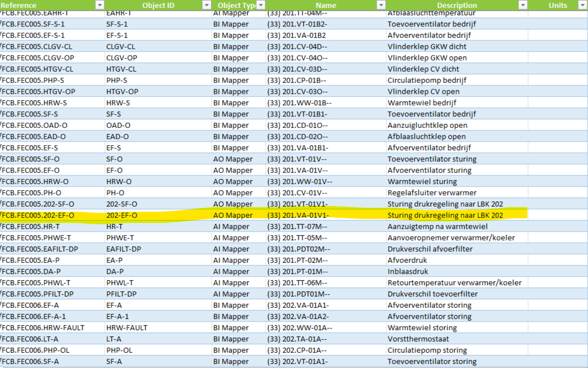
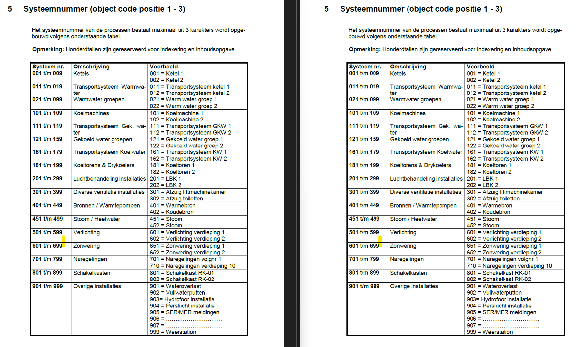

# Generate metadata schema for Johnson Control BMS tags using Brick Ontology

## Background

Timeseries identifiers of the sensors look like below: xxxxxxxxxxxxxxxxxxxxxxx/FCB.FEC005.202-EF-O.#85. This identifier is linked to the file "Combined_xxxxxxxx_Objectname-Tagname.xlsx". In this spreadsheet, these identifiers are listed under "Item Reference" column. This file contains the metedata which describes each point.

 <figure>
    

        
    

  <figcaption align="center">Object identifiers.xlsx<figcaption>
</figure>

In the same file we have the Johnson Control naming convention used to describe this data point under the "Name" column. This naming convention can be used to extract the relevant metadata for these data points.

Example Name : (33) 201.VA-01V1-

Then the metadata of the name is identified by looking at the codes (input/codes) extracted from Johnson Control "Codering afspraken" document (input/files/Standard data structure.pdf).

 <figure>
    

        
    

  <figcaption align="center">Standard data structure.pdf<figcaption>
</figure>

## Finding standard Brick tags
Relevant Brick tags according to each part of the naming convention is found and included in the file 'outputs/brick-mappings.xlsx'. Brick tags are given in the three columns 'Num Class Brick', 'Code Brick Class', and 'Last_Letter Brick  Class' columns according to the three parts of the naming convention. Empty cells mean the description of the point is not clear and therefore a Brick class is not found.

### Meilisearch_indexes.ipynb
This script is for populating the search engine with the Brick Ontology Classifications (Class Name and Definition).

